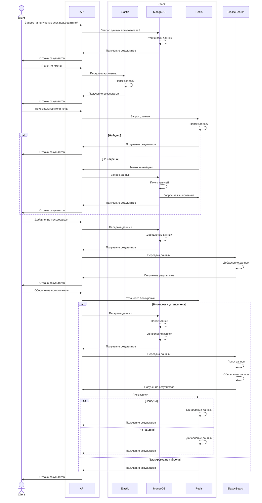

# *Twidder*
## Стэк технологий ##

 

<div align="center">

| Redis                                                                                               | MongoDB                                                                                     | ElasticSearch                                                                                    |
| --------------------------------------------------------------------------------------------------- | ------------------------------------------------------------------------------------------- | ----------------------------------------------------------------------------------------------- |
|   |  |  |
</div>


### Redis Cluster
Для быстрого доступа к данным аккаунта пользователя в проекте используется Redis Cluster, который представляет распределенную систему кэширования, обеспечивая:
- Шардирование кэша;
- Повышение отказоустойчивости;
- Возможности горизонтального масштабирования;

Текуща конфигурация кластера состоит из 3 Master - узлов, на каждый из которых приходится по 1 slave - узлу:
<div align="center">
  


</div>

#### Отказоустойчивость
Рассмотрим* случаи, с отключением узлов кластера:
| Сценарий отказа |Условие|  Влияние на работоспособность кластера | Работоспособность | Описание |
|------------------------|---|-------------------------------|---------------------|---------------------------|
| Отказ одного мастера    | Соответсвующий slave узел доступен  |Незначительное       | Да              | Master успешно заменен соответсвующей репликой, данные сохранились  |
| Отказ одного мастера    | Соответсвующий slave узел недоступен  |Критическое       | Нет              | Замена репликой невозможна, Минимально работающее количество Master узлов - 3  |
| Отказ двух мастеров    | Соответсвующие slave узлы доступны, отказы произошли не одновременно  |Значительное       | Да              | Мастера успешно заменены соответсвующими репликами   |
| Отказ двух мастеров    | Соответсвующие slave узлы недоступены  |Критическое       | Нет              | Потеря двух из трех мастеров приведет к потере кворума, требуется ручное вмешательство   |
| Отказ двух мастеров    | Соответсвующие slave узлы доступны, отказы произошли одновременно  |Критическое       | Нет              |  Потеря двух из трех мастеров приведет к потере кворума, требуется ручное вмешательство  |

*Рассматривается стандартное поведение, без настройки файлов конфигурации и т.д.


### ElasticSearch
Для работы с поисковыми запросами использовался ElasticSearch, обеспечивающий:
- Полнотекстовый поиск;
- Анализ данных;
- Эффективную работу с неструктурированными данными;

Кластер ElasticSearch состоит из 3 узлов. Каждый индекс имеет 16 шардов, который имеет первичную копию на master - node, а также две реплики на оставшихся узлах, что обеспечивает сохранность и целостность данных в случае сбоев в работе host-сервера:
<div align="center">
  


</div>

#### Отказоустойчивость
Рассмотрим случаи, с отключением узлов кластера:
| Сценарий отказа |Условие|  Влияние на работоспособность кластера | Работоспособность | Описание |
|------------------------|---|-------------------------------|---------------------|---------------------------|
| Отказ одного мастер узла    | Остальные узлы работаю  |  Незначительное       | Да              | Роль мастера перешла в ходе кворума другому узлу, потери данных не наблюдается |
| Отказ двух любых узлов   |   |Критическое       | Нет              | Кластер недоступен  |


Рассмотрим случай, с включением узла кластера:
| Сценарий включения |Условие|  Влияние на данные кластера | Описание |
|------------------------|------------------------------|---------------------|---------------------------|  
| Включение неработающего узла   | Передать данные перед включением  |Незначительное  | Данные реплицируются|
| Включение 2 неработающих узлов   | Передать данные перед включением  |Значительное  | Включеные узлы подключаются к кластеру. Переданные данные потеряны|
### MongoDB
В качестве основного хранилища данных выступает нереляционная СУБД MongoDB

Кластер MongoDB состоит из 3 узлов. 1 primary узел и 2 replica - set узла:

<div align="center">
  


</div>

#### Отказоустойчивость
Рассмотрим случаи, с отключением узлов кластера:
| Сценарий отказа |Условие|  Влияние на работоспособность кластера | Работоспособность | Описание |
|------------------------|---|-------------------------------|---------------------|---------------------------|
| Отказ primary узла    | Остальные узлы работают  |  Незначительное       | Да              | Роль primary перешла в ходе голосования secondary узлу, потери данных не наблюдается |
| Отказ secondary узла    | Остальные узлы работают  |  Незначительное       | Да              |  Потери данных не наблюдается |
| Отказ двух узлов   | Сначала отключается primary |Критическое       | Нет              | Один из secondary узлов принимает роль primary, после отключения оставшегося secondary узла, primary узел принимает роль secondary. Кластер недоступен| 
| Отказ двух secondary узлов |  |Критическое       | Нет              | После отключения secondary узлов, primary узел принимает роль secondary. Кластер недоступен| 


Рассмотрим случай, с восстановлением узлов кластера:
| Сценарий включения |Условие|  Влияние на данные кластера | Описание |
|------------------------|------------------------------|---------------------|---------------------------|  
| Включение неработающего secondary узла   | Передать данные перед включением  |Незначительное  | Недостающие данные реплицируются на востановленый узел|
| Включение неработающего primary узла   | Передать данные перед включением  |Незначительное  | Включение узла, ранее имеющиго роль primary, переводит его статус в secondary Недостающие данные реплицируются на востановленый узел|
| Включение двух узлов   | Оставшийся узел имеет статус secondary  |Критическое  | Включение узлов приводит их в статус secondary. Последний узел принимает роль primary. Ранее переданные данные потеряны|

 **Sequence диаграмма взаимодействий с аккаунтами пользователей**


 **Sequence диаграмма взаимодействий с постами пользователей**
```mermaid
sequenceDiagram
    actor Client
    participant API
box
    participant API
end
    box Stack
        participant Elastic 
        participant MongoDB
    end

    Client->>API: Запрос на получение всех постов
    API->>MongoDB: Запрос данных постов
    MongoDB->>MongoDB: Чтение всех данных
    MongoDB->>API: Получение результатов
    API->>Client: Отдача результатов

    Client->>API: Поиск по содержанию поста 
    API->>Elastic: Передача аргумента
    Elastic->>Elastic: Поиск записей
    Elastic ->> API: Получение результатов
    API->>Client: Отдача результатов

    Client->>API: Поиск по дате поста 
    API->>Elastic: Передача аргумента
    Elastic->>Elastic: Поиск записей
    Elastic ->> API: Получение результатов
    API->>Client: Отдача результатов

    Client->>API: Поиск поста по ID
        API->>MongoDB: Запрос данных
        MongoDB->>MongoDB: Поиск записей
        MongoDB->>API: Получение результатов
        API->>Client: Отдача результатов

    Client->>API: Добавление поста
    API->>MongoDB: Передача данных
    MongoDB->>MongoDB: Добавление данных
    MongoDB->>API: Получение результатов
    API->>ElasticSearch: Передача данных
    ElasticSearch->>ElasticSearch: Добавление данных
    ElasticSearch->>API: Получение результатов
    API->>Client: Отдача результатов


    Client->>API: Обновление поста
       API->>MongoDB: Передача данных
       MongoDB->>MongoDB: Поиск записи
       MongoDB->>MongoDB: Обновление записи
       MongoDB->>API: Получение результатов
       API->>ElasticSearch: Передача данных
       ElasticSearch->>ElasticSearch: Поиск записи
       ElasticSearch->>ElasticSearch: Обновление записи
       ElasticSearch->>API: Получение результатов
API->>Client: Отдача результатов


